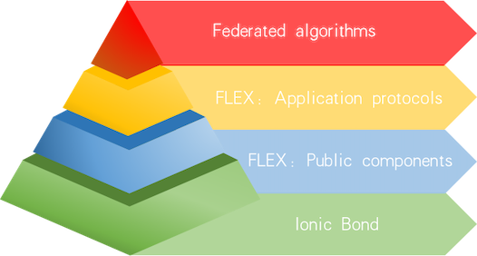

[中文](README_zh.md)

FLEX (Federated Learning Exchange) protocol is a set of standardized federal learning agreements designed by Tongdun AI Research Group. FLEX protocol sets the sequence of data exchange during the federal learning process between participants and methods for data encryption and decryption used before and after the exchange. Abiding by these agreements, participants can safely join the federation for providing data or federated services.

FLEX protocol consists of two parts:
1. Application protocols: This part of protocol is designed for federated algorithms, especially for supporting the multi-party federated learning algorithms. The protocol sets the sequence of data exchange between multiple parties and the corresponding cryptographic algorithm. The communication part, in federation process, is also  encapsulated here.
2. Public components: This part is about the basic application algorithms and security agreement being dependent on upper-level application protocol, such as homomorphic encryption and secret sharing algorithm, etc.

<div style="text-align: center;">


</div>

This project realizes these two parts, mentioned by the FLEX white paper. As for the communication part, we use the Ionic Bond protocol interface, developed by Tongdun AI Research Group, as the practice interface. It only gives you a simple implementation as a reference.

# Installation tutorial

FLEX protocol can be run directly with the source code. It supports Python 3.6 or any higher version and is available for environment variable settings.

```console
export PYTHONPATH="/path/to/flex"
```

Firstly, install the basic dependent libraries, taking the Ubuntu system as an example:

`apt install libgmp-dev, libmpfr-dev, libmpc-dev`

`pip install numpy`,`gmpy2`,`pycryptodome`,`scikit_learn`,`py_ecc`,`pandas`

Through the tools provided in FLEX is also available. Run it through source directory with:

```console
pip install .
```

After installation, the protocol can be imported by:

```console
from flex.api import *
```

# Test
FLEX provides basic test program, aiming to check the protocols during the running process. Generally, users need to install the FLEX protocol on three machines, playing the roles of Coordinator, Guest, and Host respectively. Before running the test program, users need to modify the “federal_info” according to their actual hostname or ip. There is also a stand-alone mode for users to simulate the whole process on one machine. See the [test_intro](doc/test_intro.md) for more details.


# API and documentation
FLEX uses a unified API to import the upper-layer part of the protocol, while the typical process is getting the instance through “make_protocol”, and executing it by using “exchange”. Taking security aggregation as an example:

```python
from flex.api import make_protocol
from flex.constants import OTP_SA_FT

# initialization
protocol = make_protocol(OTP_SA_FT, federal_info, sec_param, algo_param)
# excute
protocol.exchange(theta)
```

In the example, federal_info means the federal participant information; sec_param means the security parameter of the protocol, which specifies the cryptographic method and key length used in the protocol; algo_param means the algorithm hyperparameter, which can also be empty; Theta is the input of the protocol. See the [api_intro](doc/api_intro.md) for more details of parameter description and usage instructions.
About public components, it can be imported from “flex.crypto” in module API. Taking Paillier homomorphic encryption algorithm as an example:


```python
from flex.crypto.paillier.api import generate_paillier_encryptor_decryptor

# Generate Encryptor and Decryptor
pe, pd = generate_paillier_encryptor_decryptor(n_length = 2048)
# encryption
en_x = pe.encrypt(x)
en_y = pe.encrypt(y)
# sum
en_z = en_x + en_y
# decrypt
z = pd.decrypt(en_z)
```

See the [crypto_intro](doc/crypto_api_intro.md) for more details of public components.
