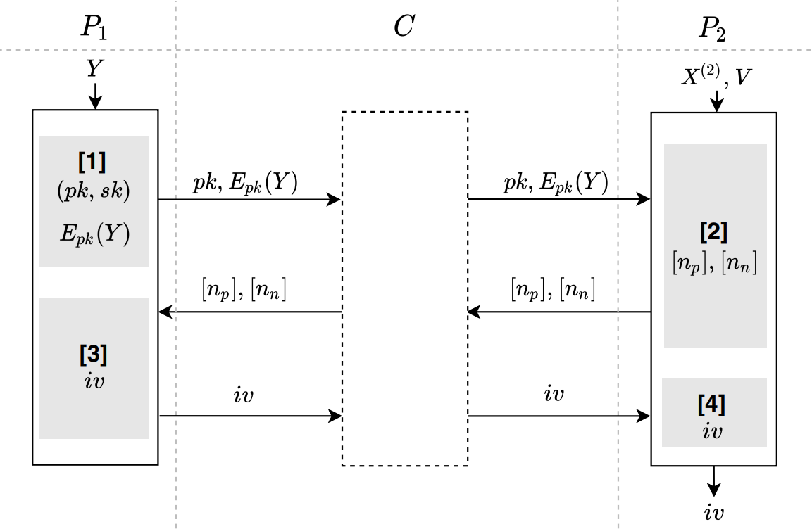

#  信息价值特征选择
## 简介
* 基于信息价值(information value: IV)的联邦特征选择协议，联邦特征选择(federated feature selection: FFS)是指对所有参与方数据的特征进行联合协同筛选，去除参与方之间重复冗余的特征，只保留更重要的特征指标，以提高训练数据质量并缩短训练时间。
  而IV值的计算以证据权重(WOE)为基础，分别定义$`p_{y_i}`$是第$`i`$个分箱中正样本占所有正样本的比例，$`p_{n_i}`$是第$`i`$个分箱中负样本占所有负样本的比例。那么第$`i`$个分箱的证据权重为$`woe_i=ln(p_{y_i}/p_{n_i})`$，相应的IV值是:$`iv_i=(p_{y_i}-p_{n_i})*woe_i`$。整个特征变量的信息价值是各分箱信息价值的和:$`iv=\sum_{i}iv_i`$。
  * 应用场景:  
    适用于跨特征联邦场景下的信息价值的计算，常用于特征选择。
  * 相关技术: 
    paillier同态加密,具体参考[paillier加密](../../../crypto/paillier/README.md);  
  * 算法流程图  
    
  * 安全要求:  
    1.特征向量在本地统计，特征数据不对外泄漏;  
    2.标签信息采用同态加密不对外泄漏.
  * 依赖的运行环境
    1. numpy>=1.18.4
    2. pandas>=0.23.4
    3. gmpy2==2.0.8
  * 协议流程，详见: [FLEX白皮书](../../../../doc/FLEX白皮书.pdf)3.2.2章节


## 类和函数
IV_FFS协议定义了两种类型的参与方，分别是Guest,Host，它们对应的类函数、初始化参数、类方法如下：

| | Guest | Host |
| ---- | ---- | ---- |
| class | IVFFSGuest | IVFFSHost |
| init | federal_info, sec_param, algo_param | fedral_info, sec_param, algo_param |
| method | exchange | exchange |

### 初始化参数
每种参与方在初始化时需要提供federal_info、sec_param和algo_param三种参数。其中federal_info提供了联邦中参与方信息，sec_param是协议的安全参数， algo_param是协议的算法参数。

* sec_param中需提供的参数有：
   * he_algo: 同态加密算法名
   * he_key_length: 同态加密密钥长度

   如:
    ```json
    {
        "he_algo": "paillier",
        "he_key_length": 1024
    }
    ```
* algo_param中需要提供的参数有：
    * adjust_value：信息价值的约束值，为了保证iv计算时分母不为0
    
   如：
    ```json
    {
        "adjust_value": 0.5
    }
    ```

### 类方法
每种参与方均提供exchange方法，如下
```python
# Guest
def exchange(self, label: Union[np.ndarray, pd.Series]) -> None
# Host
def exchange(self, feature: pd.Series, is_continuous: bool, split_info: dict) -> float
```
#### 输入
参数意义如下：
* label: 表示发起方提供的标签，数据类型可以为numpy.ndarray或pandas.Series，label长度与feature相同.
* feature: 表示参与方提供的待分箱的特征数据，数据类型为pandas.Series，feature长度与label相同.
* is_continuous: 表示参与方提供的特征数据类型是否为连续型，若为连续型，则is_continuous为True，否则为False.
* split_info: 表示参与方提供的特征分箱后的切分点信息.

例如：
```python
table = pd.read_csv(os.path.join(os.path.dirname(__file__), 'shap_finance_c.csv'), nrows=300)
label = pd.Series(table['Label'])
feature = pd.Series(table['Occupation'])
is_continuous = True
split_info = {'split_points': np.array([0.0, 1.5, 3.01, 4.15, 6.02, 7.04, 8.28, 10.1])}
```

#### 输出
Guest无输出，Host方的输出为信息价值。

## API调用
每种参与方均通过如下方式初始化：
```python
from flex.api import make_protocol
from flex.constants import IV_FFS

protocol = make_protocol(IV_FFS, federal_info, sec_param, algo_param)
```
调用时，根据federal_info中参与方角色的不同，分别返回IVFFSGuest，IVFFSHost两种类实例。

### 调用示例
#### Host
   详见: [host.py](../../../../test/federated_preprocessing/federated_feature_selection/iv_ffs/host.py)
#### Guest
   详见: [guest.py](../../../../test/federated_preprocessing/federated_feature_selection/iv_ffs/guest.py)

