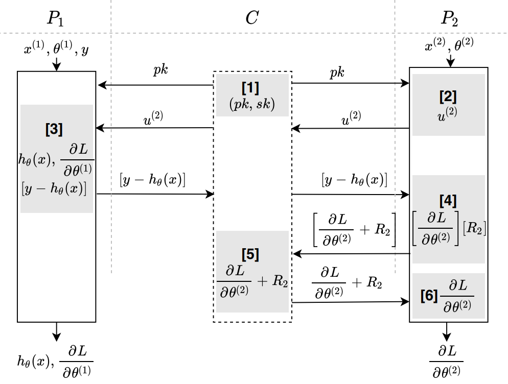

#  逻辑回归
## 简介
* 跨特征联邦逻辑回归训练（有第三方），使用同态加密(homomorphic encryption: HE)和一次一密(one-time pad)实现数据安全交换，该协议由第三方生成私钥，发起方为服务方在密文上运算梯度并使用服务方的随机数盲化，计算结果交给第三方解密。  
    * 应用场景:  
        在跨特征联邦训练中，如果模型采用逻辑回归模型，参与方之间协同计算模型参数更新时可以采用该协议。在二分类中，该协议要求标签信息取值为0或1。
    * 相关技术: 
        1. paillier同态加密,具体参考[paillier加密](../../../crypto/paillier/README.md);  
        2. 逻辑回归算法;
    * 算法流程图  
        
    * 安全要求:  
        数据交换的过程保证安全，传输的数据不会产生隐私泄漏，即其中一方(包括第三方)无法根据接收到的密文求解或推算出另一方的明文数据;  
    * 依赖的运行环境
        1. numpy>=1.18.4
        2. gmpy2==2.0.8
        3. secrets==1.0.2
    * 协议流程，详见: [FLEX白皮书](../../../../doc/FLEX白皮书.pdf)5.2.2章节

## 类和函数
HE_OTP_LR_FT2协议定义了三种类型的参与方，分别是Coordinator,Guest,Host，它们对应的类函数、初始化参数、类方法如下：

| | Coordinator | Guest | Host |
| ---- | ---- | ---- | ---- |
| class |HEOTPLogisticRegressionCoord| HEOTPLogisticRegressionGuest| HEOTPLogisticRegressionHost |
| init | federal_info, sec_param | federal_info, sec_param | fedral_info, sec_param |
| method | exchange | exchange | exchange |

### 初始化参数
每种参与方在初始化时需要提供federal_info和sec_param两种参数。其中federal_info提供了联邦中参与方信息，sec_param是协议的安全参数。

* sec_param中需提供的参数有：
   * he_algo: 同态加密算法名
   * he_key_length: 同态加密密钥长度

   如:
    ```json
    {
        "he_algo": "paillier",
        "he_key_length": 1024
    }
    ```

### 类方法
每种参与方均提供exchange方法，如下
```python
# Coordinator
def exchange(self) -> None
# Guest
def exchange(self, theta: np.ndarray, features: np.ndarray, labels: np.ndarray) -> Tuple[np.ndarray, np.ndarray]
# Host
def exchange(self, theta: np.ndarray, features: np.ndarray) -> np.ndarray
```

#### 输入
Coordinator无需输入参数，其他参数意义如下：
* theta: 表示参与方对应的模型参数， 用一维numpy.ndarray表示，长度等于特征长度
* features:表示本次训练batch内的输入特征，用二维numpy.ndarray表示，shape为(batch_size, num_features);
* labels: 表示label，用一维numpy.ndarray表示，长度等于batch大小，值为0或1.


例如， 当batch大小为32，特征数量为6时：：
```python
theta = np.random.uniform(-1, 1, (6,))
features = np.random.uniform(-1, 1, (32, 6))
labels = np.random.randint(0, 2, (32,)) 
```

#### 输出
Coordinator无输出
Guest方的输出有两个，一是$`sigmoid(\theta feature^T)`$，二是batch内的平均梯度，用一维numpy.ndarray表示
Host方的输出为batch内的平均梯度，用一维numpy.ndarray表示。

### HE_OTP_LR_FT2 调用示例

#### Host
   详见: [test_host.py](../../../../test/federated_training/logistic_regression/he_otp_lr_ft2/test_host.py)

#### Guest
   详见: [test_guest.py](../../../../test/federated_training/logistic_regression/he_otp_lr_ft2/test_guest.py)

#### Coordinator
   详见: [test_coordinator.py](../../../../test/federated_training/logistic_regression/he_otp_lr_ft2/test_coordinator.py)

### 使用HE_OTP_LR_FT2协议进行模型训练

#### host
   详见: [host.py](../../../../test/federated_training/logistic_regression/he_otp_lr_ft2/host.py)

#### guest
   详见: [guest.py](../../../../test/federated_training/logistic_regression/he_otp_lr_ft2/guest.py)
   
#### Coordinator
   详见: [coordinator.py](../../../../test/federated_training/logistic_regression/he_otp_lr_ft2/coordinator.py)